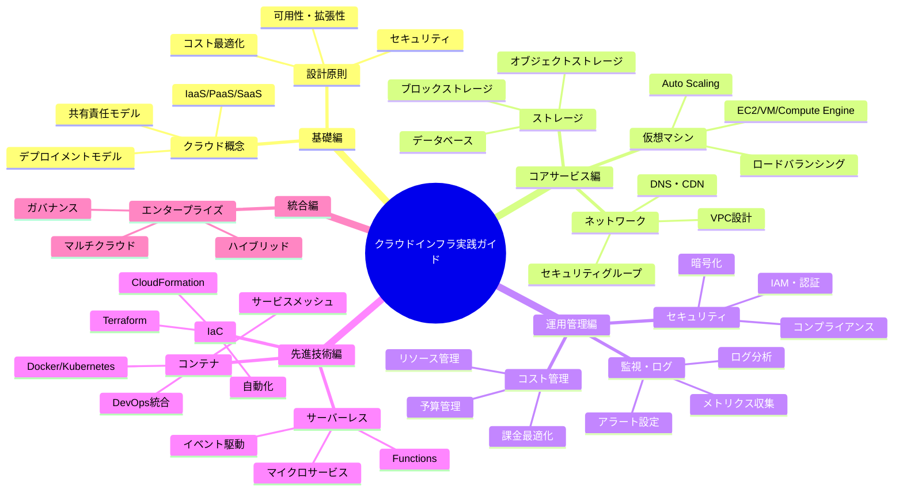

# はじめに

## 本書の目的

クラウドインフラストラクチャは、現代のIT基盤において欠かせない技術となりました。しかし、多くのエンジニアが感じているのは、「理論は理解できるが、実際の設計・構築でどう判断すればよいかわからない」という悩みです。

本書は、クラウドインフラエンジニアが実際の業務で直面する設計・構築の課題に対して、**なぜその選択をするのか**という原理原則と実装判断の根拠を丁寧に解説する実践書です。

単なる操作手順書ではなく、変化し続けるクラウド技術に対応できる「考え方」を身につけることを最重要視しています。

## 本書の特徴

### 概念と実装のバランス

- **概念説明 30%**: 設計の背景にある原理原則
- **実装アプローチ 50%**: 具体的な設計・構築手法
- **運用考慮点 20%**: 継続的な改善と最適化

### 対象読者

- クラウドインフラエンジニア（経験年数 1-5年）
- オンプレミス環境からクラウドへの移行を検討している方
- より体系的なクラウド知識を身につけたい方

### 扱う技術範囲

主要クラウドプロバイダー（AWS、Azure、GCP）に共通する概念と実装パターンを中心に、プロバイダー固有の特徴も適切に解説します。

## 本書の構成

### 第一部：基礎編（第1-2章）
クラウドコンピューティングの本質と、インフラ設計に必要な共通概念を理解します。

### 第二部：コアサービス編（第3-5章）
仮想マシン、ストレージ、ネットワークなど、クラウドインフラの中核となるサービスの設計・構築を学びます。

### 第三部：運用管理編（第6-8章）
セキュリティ、監視、コスト管理など、継続的な運用に必要な知識を身につけます。

### 第四部：先進技術編（第9-10章）
サーバーレス、コンテナ、Infrastructure as Code など、次世代のクラウド技術を理解します。

### 第五部：統合編（第11章）
エンタープライズグレードのアーキテクチャパターンと実践事例を通じて、総合的な設計能力を養います。

## 学習の進め方

1. **順次学習**: 章の順番通りに進めることで、知識が段階的に積み上がります
2. **実践重視**: 各章の内容を実際の環境で試してみることを強く推奨します
3. **継続的な参照**: 実務での疑問が生じた際の参照書として活用してください

## 本書で身につく能力

- 要件に応じた適切なクラウドアーキテクチャの設計
- コスト効率と性能のバランスを考慮した実装
- セキュリティとコンプライアンスを満たす設計
- 運用性を考慮した監視・ログ管理体制の構築
- 変化する要件に対応できる拡張性のある設計

クラウドインフラエンジニアとして、一歩先を行く設計・構築能力を身につけるための実践的なガイドとして、本書をご活用ください。

```mermaid
flowchart TD
    subgraph "学習ロードマップとスキル習得の流れ"
        subgraph "初級レベル (1-2年目)"
            Basic1["基礎概念理解<br/>・クラウドサービスモデル<br/>・主要プロバイダー比較<br/>・基本的な料金体系"]
            Basic2["コアサービス操作<br/>・VM作成・管理<br/>・ストレージ設定<br/>・基本的なネットワーク設定"]
            Basic3["セキュリティ基礎<br/>・IAM基本設定<br/>・セキュリティグループ<br/>・暗号化の適用"]
        end
        
        subgraph "中級レベル (2-4年目)"
            Mid1["アーキテクチャ設計<br/>・可用性設計<br/>・スケーラビリティ考慮<br/>・コスト最適化"]
            Mid2["運用自動化<br/>・監視・ログ設定<br/>・バックアップ戦略<br/>・災害復旧計画"]
            Mid3["先進技術活用<br/>・コンテナ導入<br/>・サーバーレス設計<br/>・IaC実装"]
        end
        
        subgraph "上級レベル (4年目以上)"
            Adv1["エンタープライズ設計<br/>・マルチクラウド戦略<br/>・ハイブリッド環境<br/>・ガバナンス体制"]
            Adv2["組織レベル最適化<br/>・DevOps文化醸成<br/>・技術戦略立案<br/>・チームリーダーシップ"]
            Adv3["イノベーション推進<br/>・新技術評価<br/>・PoC企画・実行<br/>・業界トレンド発信"]
        end
        
        subgraph "実践スキル獲得プロセス"
            Theory["理論学習<br/>30%"]
            HandsOn["ハンズオン<br/>50%"]
            Project["プロジェクト適用<br/>20%"]
        end
        
        subgraph "キャリアパス例"
            Path1["インフラエンジニア<br/>→ クラウドアーキテクト"]
            Path2["DevOpsエンジニア<br/>→ SREスペシャリスト"]
            Path3["セキュリティエンジニア<br/>→ クラウドセキュリティ"]
            Path4["技術リーダー<br/>→ CTOレベル"]
        end
        
        Basic1 --> Basic2
        Basic2 --> Basic3
        Basic3 --> Mid1
        
        Mid1 --> Mid2
        Mid2 --> Mid3
        Mid3 --> Adv1
        
        Adv1 --> Adv2
        Adv2 --> Adv3
        
        Theory -.-> Basic1
        HandsOn -.-> Mid1
        Project -.-> Adv1
        
        Basic3 -.-> Path1
        Mid2 -.-> Path2
        Mid3 -.-> Path3
        Adv3 -.-> Path4
    end
    
    style Basic1 fill:#e8f5e8
    style Mid1 fill:#fff3e0
    style Adv1 fill:#e3f2fd
    style Theory fill:#f3e5f5
    style Path4 fill:#ffe0b2
```

---

[第1章：クラウドコンピューティングの基礎](../chapter-chapter01/index.md)へ進む